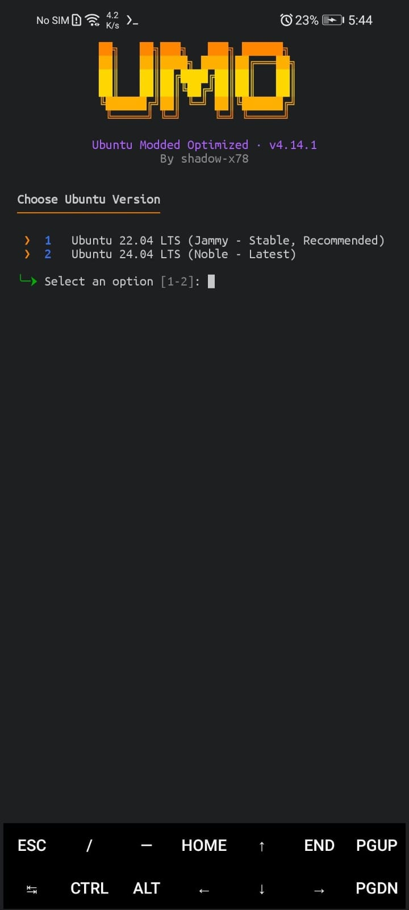
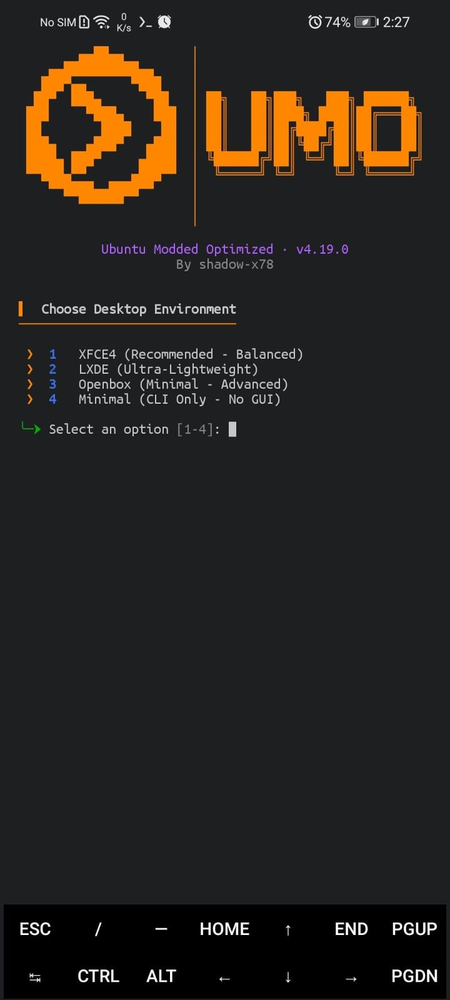
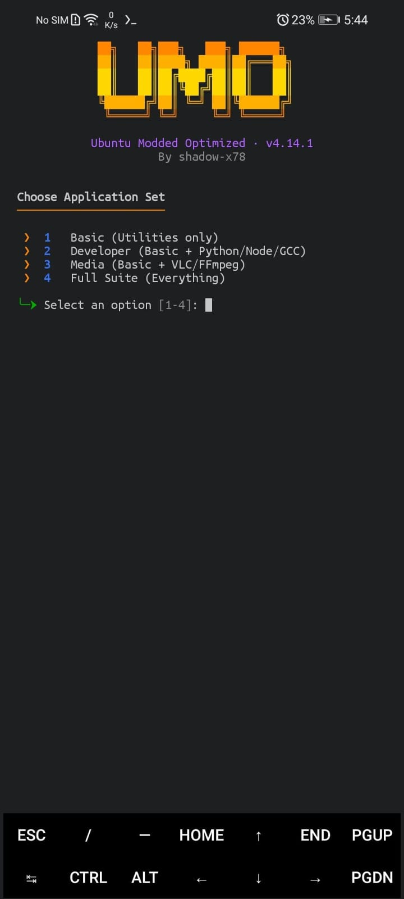
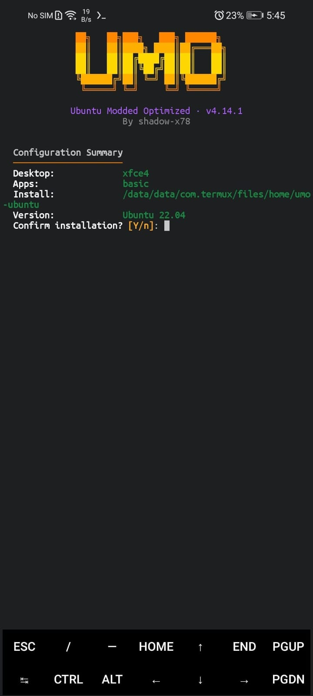

<div align="center">

<pre align="center">
 ██╗   ██╗███╗   ███╗ ██████╗
  ██║   ██║████╗ ████║██╔═══██╗
  ██║   ██║██╔████╔██║██║   ██║
  ██║   ██║██║╚██╔╝██║██║   ██║
  ╚██████╔╝██║ ╚═╝ ██║╚██████╔╝
  ╚═════╝ ╚═╝     ╚═╝ ╚═════╝
</pre>

# Ubuntu Modded Optimized

أوبنتو كامل على هاتفك الأندرويد - أمر واحد، بدون تعقيد

[](CHANGELOG.md)
[](LICENSE)


[](https://github.com/shadow-x78/ubuntu-modded-optimized/stargazers)

</div>

---

## 🌐 اللغة

<a href="README.md">🇬🇧 English</a> · <a href="README_AR.md">🇸🇦 العربية</a>

---

## 📋 فهرس المحتويات

- [ما هو UMO؟](#what-is-umo)
- [لقطات الشاشة](#screenshots)
- [بيئات سطح المكتب](#desktop-environments)
- [البدء السريع](#quick-start)
- [الأوامر](#commands)
- [خيارات سطر الأوامر](#cli-options)
- [المتطلبات](#requirements)
- [هيكل المشروع](#project-structure)
- [التوثيق](#documentation)
- [المساهمة](#contributing)
- [الرخصة](#license)

---

<a id="what-is-umo"></a>
## 🤔 ما هو UMO؟

**UMO (Ubuntu Modded Optimized)** هو مثبِّت Ubuntu مفتوح المصدر لـ Termux، مُعاد كتابته من الصفر لحل المشاكل الجذرية الموجودة في كل مشروع مشابه. لا تبعيات واجهة خارجية، لا إعداد يدوي، لا مفاجآت.

| المشكلة | المشاريع الأخرى | UMO |
|---------|----------------|-----|
| واجهة `dialog` تنكسر | ❌ لا تزال تستخدمها | ✅ TUI نقي بـ POSIX sh - بدون تبعيات |
| VNC يموت عند قفل الشاشة | ❌ لا يوجد حل | ✅ `termux-wake-lock` مدمج |
| لا صوت داخل proot | ❌ حل يدوي | ✅ جسر PulseAudio عبر TCP |
| `systemctl` يفشل | ❌ أخطاء محيّرة | ✅ محاكي shell عام (أي خدمة) |
| عشرون خطوة يدوية | ❌ معقد للغاية | ✅ أمر واحد: `bash install.sh` |

---

<a id="screenshots"></a>
## 🖼️ لقطات الشاشة

<p align="center">
  
  
  
  
</p>

---

<a id="desktop-environments"></a>
## 🖥️ بيئات سطح المكتب

| البيئة | النوع | مناسبة لـ | تصميم UMO |
|--------|-------|-----------|-----------|
| **XFCE4** | Full DE | الاستخدام اليومي - أداء متوازن | بانر مصمم، نوافذ xfwm4، خلفية، قائمة whisker |
| **LXDE** | Lightweight DE | الأجهزة القديمة وضعيفة الموارد | lxpanel مصمم، خلفية عبر pcmanfm |
| **Openbox** | Window Manager | المستخدمون المتقدمون، بصمة خفيفة | نوافذ Clearlooks، بانر tint2، قائمة root |
| **Minimal** | CLI only | السيرفرات والاستخدام بدون واجهة | طرفية فقط - بدون سمة |

جميع الواجهات الرسومية تحصل على نظام التصميم الكامل: سمة Orchis (المضغوطة)، أيقونات Tela، مؤشر DMZ، خطا Ubuntu SemiBold + FiraCode Nerd Mono، إعدادات Fastfetch جاهزة، وخلفية UMO - مطبقة على المستخدمَين **root و umo** معاً. اختر **الوضع الليلي** (Orchis-Dark-Compact + Tela-Black-Dark) أو **الوضع النهاري** (Orchis-Light-Compact + Tela) من قائمة المثبّت، أو عبر `--theme=umo-dark|umo-light`.

**يشمل:** TigerVNC · جسر PulseAudio · Termux:X11 · محاكي systemctl عام · التحكم بالجلسات

---

<a id="quick-start"></a>
## 🚀 البدء السريع

```bash
bash <(curl -fsSL https://raw.githubusercontent.com/shadow-x78/ubuntu-modded-optimized/main/umo.sh)
```

يقوم بتنزيل آخر إصدار من GitHub (مع تحقق SHA-256) وتشغيل المثبّت. للتثبيت الصامت:

```bash
curl -fsSL https://raw.githubusercontent.com/shadow-x78/ubuntu-modded-optimized/main/umo.sh -o umo.sh && bash umo.sh --no-gui --de=xfce4 --apps=full
```

### من الكود المصدري (للمساهمين)

```bash
git clone https://github.com/shadow-x78/ubuntu-modded-optimized.git ~/UMO
cd ~/UMO
bash install.sh
```

بعد التثبيت:

```bash
umo start
umo login
```

---

<a id="commands"></a>
## ⌨️ الأوامر

### في Termux

| الأمر | الوصف |
|-------|-------|
| `umo start` | بدء الجلسة مع VNC والصوت |
| `umo stop` | إيقاف جميع الخدمات |
| `umo status` | عرض حالة الخدمات |
| `umo login` | الدخول كـ root |
| `umo user` | الدخول كمستخدم افتراضي |
| `umo run "<cmd>"` | تنفيذ أمر واحد داخل الحاوية |
| `umo backup [dir]` | أرشفة جذر نظام Ubuntu |
| `umo update` | تحديث كامل: جلب آخر نسخة من UMO، إعادة تطبيق إعداداتك المحفوظة (وضع الثيم، فئة التطبيقات، سطح المكتب)، وترقية كل حزم أوبونتو. استخدم `--scripts-only` للتحديث السريع للسكربتات فقط أو `--no-upgrade` لتخطي ترقية نظام أوبونتو |
| `umo refresh` | إعادة توليد واجهة `umo` وسكربتات الهوست والحاوية من النسخة المحلية للأداة (بدون سحب git) |
| `umo uninstall` | إزالة UMO بالكامل (الجذر، سكربتات الهوست، أمر `umo`، والـ aliases) |
| `umo version` | عرض إصدار UMO الحالي |

> سكربتات الهوست (`umo-login.sh`، `umo-start.sh`، `umo-stop.sh`، `umo-vnc-*.sh`، `aliases.sh`) تُثبَّت في `~/.umo/` — فيبقى مجلد Termux الرئيسي نظيفًا. يضيف المثبّت سطرًا في ملف الـ shell rc يستدعي `~/.umo/aliases.sh`، فتصبح `umo-start` و`umo-stop` و`umo-startvnc` و`umo-stopvnc` و`umo-login` و`umo-user` أوامر مباشرة.
### داخل Ubuntu

| الأمر | الوصف |
|-------|-------|
| `umo-startvnc` | تشغيل خادم VNC |
| `umo-stopvnc` | إيقاف خادم VNC |
| `systemctl start <service>` | تشغيل خدمة (محاكى) |
| `systemctl status <service>` | فحص حالة الخدمة |
| `systemctl restart <service>` | إعادة تشغيل خدمة |

---

<a id="cli-options"></a>
## 🔧 خيارات سطر الأوامر

```bash
bash install.sh [OPTIONS]

  --no-gui, --non-interactive    تجاوز القوائم، استخدام الافتراضيات أو متغيرات البيئة
  --de=xfce4|lxde|openbox        اختيار بيئة سطح المكتب
  --apps=basic|dev|media|full    مجموعة التطبيقات المراد تثبيتها
  --dir=PATH                     مسار تثبيت مخصص
  --ubuntu=22.04|24.04           إصدار Ubuntu المطلوب
  --perf=balanced|aggressive|off اختيار مستوى الأداء
  --theme=umo-dark|umo-light|none
                                 اختيار مظهر سطح المكتب (الافتراضي: umo-dark)
  --mode=dark|light              بديل مختصر لـ --theme (داكن/فاتح)
  --lean                         حذف ملفات التوثيق واللغات لتوفير المساحة
```

---

<a id="requirements"></a>
## 📋 المتطلبات

- Android 8.0+ - معالج ARM64 بنية (aarch64)
- Termux من F-Droid أو GitHub - **ليس** من Play Store
- مساحة حرة 2 GB+
- اتصال بالإنترنت

---

<a id="project-structure"></a>
## 🏗️ هيكل المشروع

```
UMO/
├── bin/
│   ├── umo-install          # المثبِّت الرئيسي
│   ├── umo-start            # مشغِّل الجلسة (Termux)
│   └── umo-stop             # موقف الجلسة (Termux)
├── lib/
│   ├── core-ansi.sh         # محرك الألوان والـ logging والـ banners
│   ├── core-ui.sh           # محرك TUI: قوائم، prompts، panels
│   ├── core-system.sh       # كشف المنصة، التخزين، الإنترنت
│   ├── core-net.sh          # التنزيل، المرايا، الاستخراج
│   └── core-fs.sh           # عمليات الملفات الآمنة والـ backups
├── modules/
│   ├── umo-proot.sh         # إعداد حاوية proot
│   ├── umo-vnc.sh           # تثبيت TigerVNC وإدارة الجلسات
│   ├── umo-audio.sh         # جسر PulseAudio عبر TCP
│   ├── umo-systemctl.sh     # محاكي systemctl
│   ├── umo-desktop.sh       # مثبِّت بيئات سطح المكتب
│   ├── umo-theme.sh         # محرك تصميم الواجهات (كل بيئات سطح المكتب)
│   └── umo-apps.sh          # مثبِّت مجموعات التطبيقات
├── config/
│   ├── xstartup             # قالب جلسة VNC
│   └── theme/               # قوالب التصميم: GTK، XFCE4، LXDE، Openbox، الخطوط، الخلفية
├── docs/
│   ├── INSTALL.md           # دليل التثبيت التفصيلي
│   └── TROUBLESHOOTING.md   # المشاكل الشائعة وحلولها
├── install.sh               # نقطة الدخول السريعة
├── umo.sh                   # مثبِّت سطر واحد (curl | bash)
├── CHANGELOG.md             # سجل التغييرات
├── LICENSE                  # GPL-3.0-or-later
└── README.md                # الملف الرئيسي
```

---

<a id="documentation"></a>
## 📚 التوثيق

| المستند | الوصف |
|---------|-------|
| [INSTALL_AR.md](docs/INSTALL_AR.md) | دليل التثبيت التفصيلي |
| [TROUBLESHOOTING_AR.md](docs/TROUBLESHOOTING_AR.md) | المشاكل الشائعة وحلولها |

---

<a id="contributing"></a>
## 🤝 المساهمة

1. Fork المستودع
2. أنشئ فرعاً جديداً: `git checkout -b feature/my-feature`
3. Commit التغييرات
4. Push إلى الفرع
5. افتح Pull Request

---

<a id="license"></a>
## 📜 الرخصة

مرخّص تحت [رخصة GPL-3.0](LICENSE).

---

<div align="center">

بُني بواسطة <a href="https://github.com/shadow-x78">shadow-x78</a> ·
[سجل التغييرات](CHANGELOG.md)

<sub>&copy; 2026 Ubuntu Modded Optimized (UMO)</sub>

</div>
